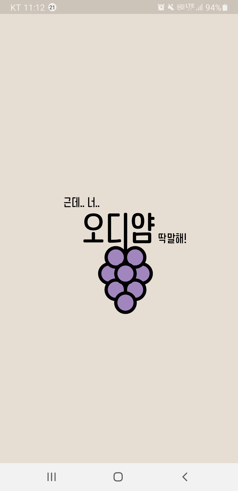
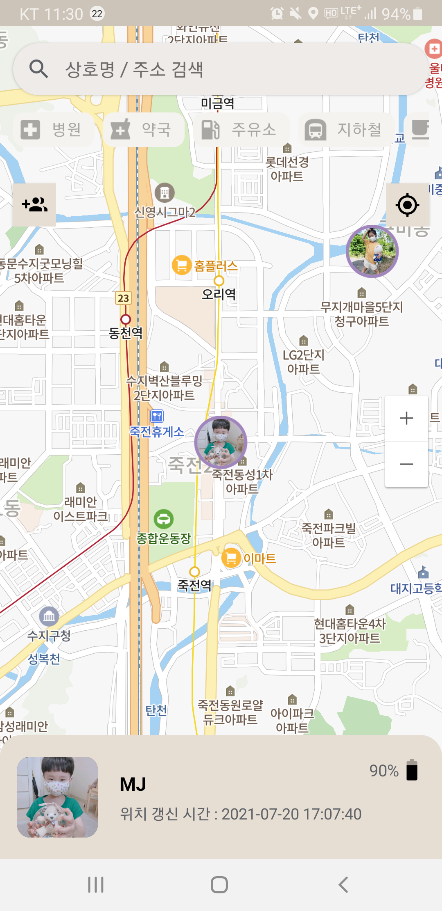
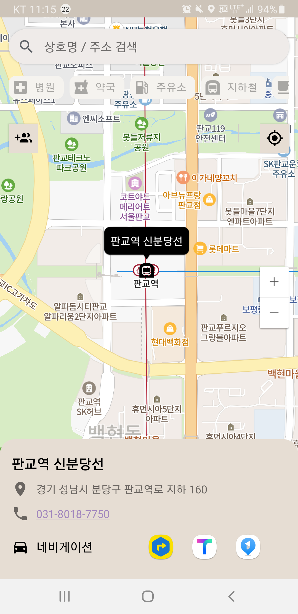
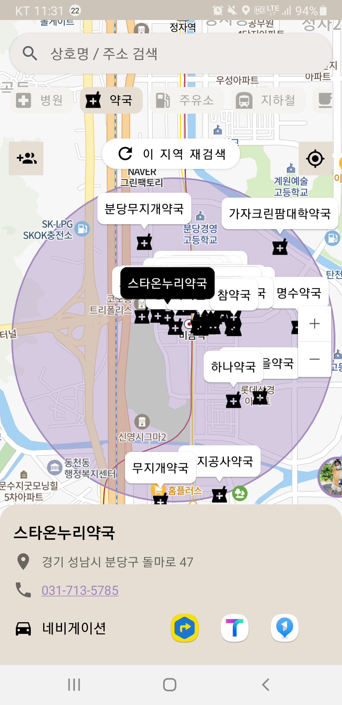
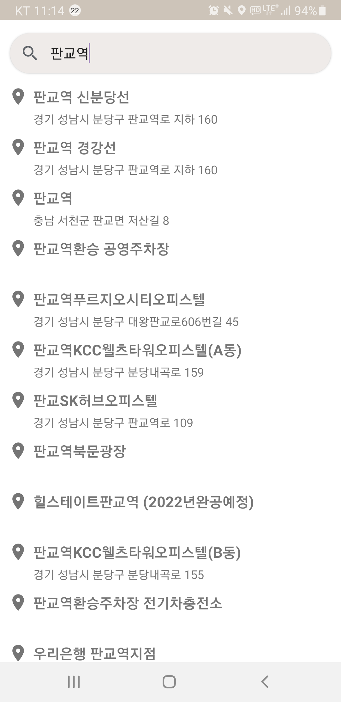
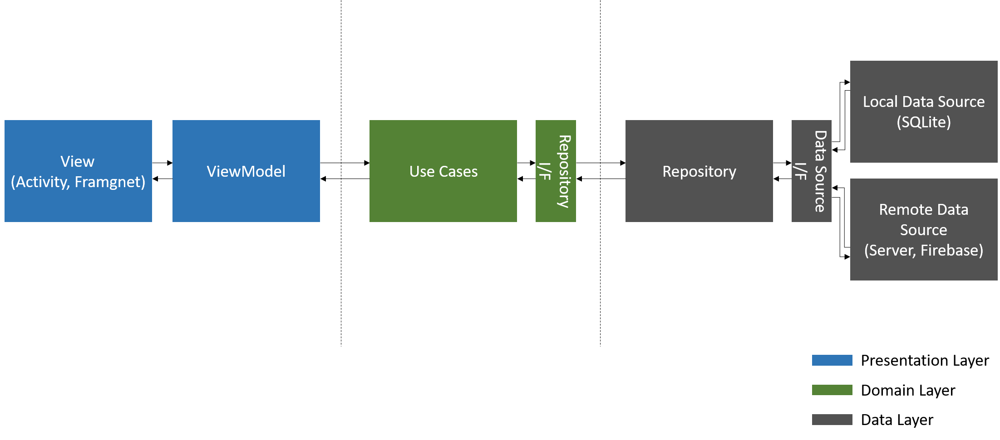

# 🍇🍇 Odiyam 🍇🍇

위치 정보 공유 어플리케이션

  

  
### Language

- Kotlin

### Architecture

- Clean Architecture(Multi Module) + MVVM

### Libraries

- DI: Hilt
- Network: Retrofit
- Database: Room, Firebase Realtime Database
- Image: Glide
- Map: Naver Map
- Storage: Firebase Storage
- Crashlytics: Firebase Crashlytics
- Authentication: Firebase Authentication
- Location Search: Kakao API

